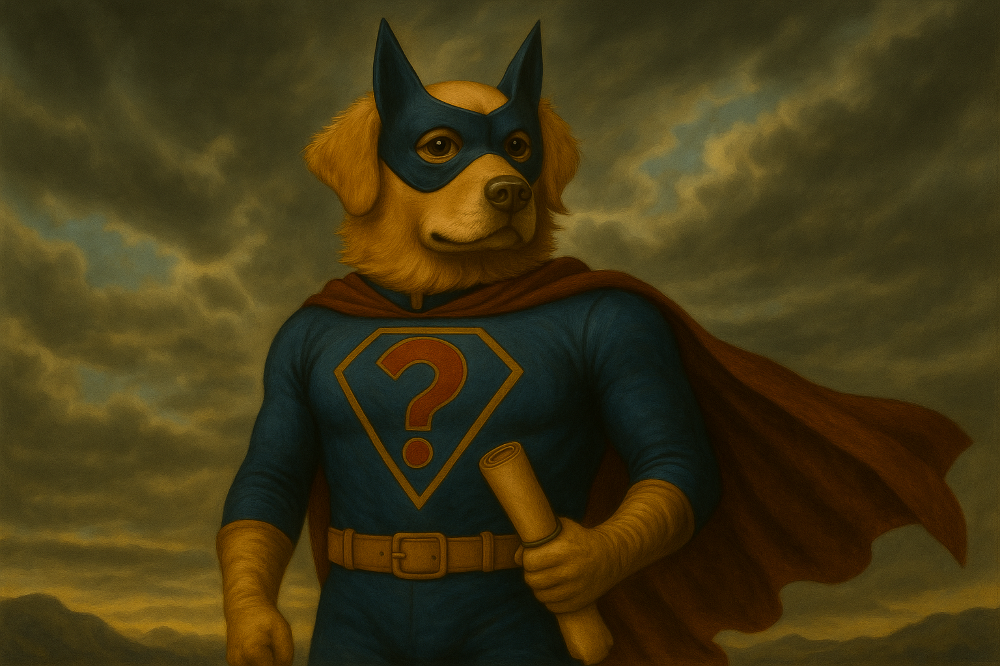

slidenumbers: true
slidecount: true 


---


---


---


---

#`dog`
###`⠀`
###`⠀`
###`⠀`

---
[.footer: You: What's S in Morse? Me: ...]


#`dog`
###`↓`
###`⠀`
###`━••  ━━━  ━━•`

^
19th Century


---
[.footer: To any blind people offended by that joke, you know where to find me!]


#`dog`
###`↓`  
###`⠀`
###`⠙⠕⠛`


^
19th Century

---

#`dog`
###`↓`
###`⠀` 
###`[64 6f 67]`

---
[.footer: [https://github.com/patrickjolliffe/presentations-charset] (https://github.com/patrickjolliffe/presentations-charset)]
####`➜ 🐈 80dogs.txt` 
[.column]
```
Hund
Ha'DIbaH
abwo
alabai
anjing
ashun
aso
cane
cão
câin
câine
câini
chien
chó
cyn
dog
emba
ghaddu
gom
hond
```


[.column]
```
hondur
hualp
huan
hund
imba
imbua
imbwe
inu
it
jindo
kelb
khuy
klèb
koer
koira
kotta
køter
kutya
kutta
köpek
```
[.column]
```
köpeği
mbula
mbwa
mbwagh
mbwá
mbwene
mbʉ
njau
njoka
pa
perro
pes
pies
qen
qeni
sag
sagol
sobaka
suns
szczeniak
```
[.column]
```
tz’i’
ukudla
welpe
xolo
zwin
āso
āšun
šuo
אבו
כּלב
كلب
कुत्ता
ฆ่า
犬
狗
ⴽⵍⴱ
łééchąą’í
𐀠
𓃥
🐶
```

---
* **Before Unicode**
* Unicode
* Oracle CharacterSet

---
|    | `0` | `1` | `2` | `3` | `4` | `5` | `6` | `7` | `8` | `9` | `a` | `b` | `c` | `d` | `e` | `f` |
|:---|:---:|:---:|:---:|:---:|:---:|:---:|:---:|:---:|:---:|:---:|:---:|:---:|:---:|:---:|:---:|:---:|
|`0x`|     | `1` | `2` | `3` | `4` | `5` | `6` | `7` | `8` | `9` | `0` | `#` | `@` | `:` | `>` | `√` |
|`1x`| `␢` | `/` | `S` | `T` | `U` | `V` | `W` | `X` | `Y` | `Z` | `⧧` | `,` | `%` | `γ` | `\` | `⧻` |
|`2x`| `-` | `J` | `K` | `L` | `M` | `N` | `O` | `P` | `Q` | `R` | `!` | `#` | `*` | `]` | `;` | `Δ` |
|`3x`| `&` | `A` | `B` | `C` | `D` | `E` | `F` | `G` | `H` | `I` | `?` | `.` | `⌑` | `[` | `<` | `⯒` |


^
BCD
6 bits
`##`
not sequential

---
[.code-highlight: 1]
[.code-highlight: 1,3]
[.code-highlight: 1,3,10]
[.code-highlight: 1,3,10,15]

```
➜ encode.py 80dogs.txt ascii

✅ ascii: 53 good dogs
  Ha'DIbaH  Hund  abwo  alabai  anjing  ashun  aso  cane  chien  cyn  dog  emba
  ghaddu  gom  hond  hondur  hualp  huan  hund  imba  imbua  imbwe  inu  it
  jindo  kelb  khuy  koer  koira  kotta  kutta  kutya  mbula  mbwa  mbwagh  mbwene
  njau  njoka  pa  perro  pes  pies  qen  qeni  sag  sagol  sobaka  suns
  szczeniak  ukudla  welpe  xolo  zwin

❌ ascii: 27 bad dogs
  chó  câin  câine  câini  cão  klèb  köpek  köpeği  køter  mbwá  mbʉ  tz'i'
  āso  āšun  łééchąą'í  šuo  אבו  כּלב  كلب  कुत्ता  ฆ่า  ⴽⵍⴱ  犬  狗
  𐀠  𓃥  🐶

✅ ascii   : 53 good dogs, 240 chars encoded in  240 bytes, 1.00 bytes per char
```

^
1968
coverage
efficiency

---
[.footer: "Go not to the Elves for counsel, for they will say both no and yes"]

#`Huan`
###`➜[48 75 61 6e] (ascii)`

---
[.footer: How many Vulcans does it take to change a light bulb?  Approximately 1.00000]

#Ha'DIbaH
###`➜[48 61 27 44 49 62 61 48] (ascii)`


---
|`ascii`| `0` | `1` | `2` | `3` | `4` | `5` | `6` | `7` | `8` | `9` | `a` | `b` | `c` | `d` | `e` | `f` |
|:--     |:---:|:---:|:---:|:---:|:---:|:---:|:---:|:---:|:---:|:---:|:---:|:---:|:---:|:---:|:---:|:---:|
|**`0x`**|`<nul>`| `<soh>` | `<stx>` | `<etx>` | `<eot>` | `<enq>` | `<ack>` | `<bel>` | `<bs>` | `<tab>`|`<lf>`|`<vt>`|`<ff>`| `<cr>` | `<so>` | `<si>` |
|**`1x`**| `<dle>` | `<dc1>` | `<dc2>` | `<dc3>` | `<dc4>` | `<nak>` | `<syn>` | `<etb>` | `<can>` | `<em>` | `<sub>` | `<esc>` | `<fs>` | `<gs>` | `<rs>` | `<us>` |
|**`2x`**|  | `!` | `"` | `#` | `$` | `%` | `&` | `'` | `(` | `)` | `*` | `+` | `,` | `-` | `.` | `/` |
|**`3x`**| `0` | `1` | `2` | `3` | `4` | `5` | `6` | `7` | `8` | `9` | `:` | `;` | `<` | `=` | `>` | `?` |
|**`4x`**| `@` | `A` | `B` | `C` | `D` | `E` | `F` | `G` | `H` | `I` | `J` | `K` | `L` | `M` | `N` | `O` |
|**`5x`**| `P` | `Q` | `R` | `S` | `T` | `U` | `V` | `W` | `X` | `Y` | `Z` | `[` | `\` | `]` | `^` | `_` |
|**`6x`**| `` ` `` | `a` | `b` | `c` | `d` | `e` | `f` | `g` | `h` | `i` | `j` | `k` | `l` | `m` | `n` | `o` |
|**`7x`**| `p` | `q` | `r` | `s` | `t` | `u` | `v` | `w` | `x` | `y` | `z` | `{` | `\|` | `}` | `~` | `<del>` |


^
7 bit
8th bit checksum

---
```
"WOOF"➜[01010111 01001111 01001111 01000110]
"woof"➜[01110111 01101111 01101111 01100110]

"HAU"➜[1001000 1000001 1010101]
"hau"➜[1101000 1100001 1110101]
```

---
#iso-8859

^
set of standards
1987➜2001

---
| Standard      | Alias       | Region                   | Year |
|:--            |:--         | :--                       | --:  |
| **`iso-8859-1`**  | **`latin1`**   | **Western Europe**            | 1987 |
| **`iso-8859-2`**  | **`latin2`**   | **Central & Eastern Europe**  | 1987 |
| `iso-8859-3`  | `latin3`   | South Europe              | 1988 |
| `iso-8859-4`  | `latin4`   | North Europe              | 1988 |
| `iso-8859-5`  | `cyrillic` |                           | 1988 |
| `iso-8859-6`  | `arabic`   |                           | 1987 |
| `iso-8859-7`  | `greek`    |                           | 1987 |
| `iso-8859-8`  | `hebrew`   |                           | 1988 |
| `iso-8859-9`  | `latin5`   | Turkish                   | 1989 |
| `iso-8859-10` | `latin6`   | Nordic                    | 1992 |
| `iso-8859-11` | `thai`     |                           | 2001 |
| `iso-8859-13` | `latin7`   | Baltics                   | 1998 |
| `iso-8859-14` | `latin8`   | Celtic                    | 1998 |
| **`iso-8859-15`** | **`latin9`**   | **Western Europe (Improved)** | 1999 |
| `iso-8859-16` | `latin10`  | South-Eastern Europe      | 2001 |

^
latin2 poland
latin9 improved latin1 €


---
[.code-highlight: 1]
[.code-highlight: 1,3]
[.code-highlight: 1,3,10]
[.code-highlight: 1,3,10,13]
[.code-highlight: 1,3,10,13,17-18]
```
➜ encode.py 80dogs.txt ascii latin1

✅ ascii ✅ latin1: 53 good dogs
  Ha'DIbaH  Hund  abwo  alabai  anjing  ashun  aso  cane  chien  cyn  dog  emba
  ghaddu  gom  hond  hondur  hualp  huan  hund  imba  imbua  imbwe  inu  it
  jindo  kelb  khuy  koer  koira  kotta  kutta  kutya  mbula  mbwa  mbwagh  mbwene
  njau  njoka  pa  perro  pes  pies  qen  qeni  sag  sagol  sobaka  suns
  szczeniak  ukudla  welpe  xolo  zwin

❌ ascii ✅ latin1: 9 dogs were bad, now good
  chó  câin  câine  câini  cão  klèb  köpek  køter  mbwá

❌ ascii ❌ latin1: 18 bad dogs
  köpeği  mbʉ  tz'i'  āso  āšun  łééchąą'í  šuo  אבו  כּלב  كلب  कुत्ता  ฆ่า
  ⴽⵍⴱ  犬  狗  𐀠  𓃥  🐶

✅ ascii   : 53 good dogs, 240 chars encoded in  240 bytes, 1.00 bytes per char
✅ latin1  : 62 good dogs, 278 chars encoded in  278 bytes, 1.00 bytes per char
```

---
[.footer: O meu cão não tem nariz. Como é que ele cheira? Terrível!]

#`cão`
###`➜[63 e3 6f] (latin1)` 

---
[.footer: The less racist version of the romanian dog, see I am learning a little cultural sensitivity!]

#`câine`
###`➜[63 e2 69 6e 65] (latin1)` 


---
[.code-highlight: 1]
[.code-highlight: 1,3]
[.code-highlight: 1,3,10]
[.code-highlight: 1,3,10,13]
[.code-highlight: 1,3,10,13,17-18]
```
➜ encode.py 80dogs.txt ascii latin2

✅ ascii ✅ latin2: 53 good dogs
  Ha'DIbaH  Hund  abwo  alabai  anjing  ashun  aso  cane  chien  cyn  dog  emba
  ghaddu  gom  hond  hondur  hualp  huan  hund  imba  imbua  imbwe  inu  it
  jindo  kelb  khuy  koer  koira  kotta  kutta  kutya  mbula  mbwa  mbwagh  mbwene
  njau  njoka  pa  perro  pes  pies  qen  qeni  sag  sagol  sobaka  suns
  szczeniak  ukudla  welpe  xolo  zwin

❌ ascii ✅ latin2: 7 dogs were bad, now good
  chó  câin  câine  câini  köpek  mbwá  šuo

❌ ascii ❌ latin2: 20 bad dogs
  cão  klèb  köpeği  køter  mbʉ  tz'i'  āso  āšun  łééchąą'í  אבו  כּלב  كلب
  कुत्ता  ฆ่า  ⴽⵍⴱ  犬  狗  𐀠  𓃥  🐶

✅ ascii   : 53 good dogs, 240 chars encoded in  240 bytes, 1.00 bytes per char
✅ latin2  : 60 good dogs, 269 chars encoded in  269 bytes, 1.00 bytes per char
```

---
[.footer: What does a Turkish dog eat? Barklava!]

#`köpek`
###`➜[6b f6 70 65 6b] (latin2)`

^
turkish

---

#`šuo`
###`➜[b9 75 6f] (latin2)`


^
lithuanian

---
|`ascii`| `0` | `1` | `2` | `3` | `4` | `5` | `6` | `7` | `8` | `9` | `a` | `b` | `c` | `d` | `e` | `f` |
| :-- | :--: | :--: |:--:|:--:|:--:|:--:|:--:|:--:|:--:|:--:|:--:|:--:|:--:|:--:|:--:|:--:|
| `0x` | `<nul>` | `<soh>` | `<stx>` | `<etx>` | `<eot>` | `<enq>` | `<ack>` | `<bel>` | `<bs>` | `<tab>` | `<lf>` | `<vt>` | `<ff>` | `<cr>` | `<so>` | `<si>` |
| `1x` | `<dle>` | `<dc1>` | `<dc2>` | `<dc3>` | `<dc4>` | `<nak>` | `<syn>` | `<etb>` | `<can>` | `<em>` | `<sub>` | `<esc>` | `<fs>` | `<gs>` | `<rs>` | `<us>` |
| `2x` |  | `!` | `"` | `#` | `$` | `%` | `&` | `'` | `(` | `)` | `*` | `+` | `,` | `-` | `.` | `/` |
| `3x` | `0` | `1` | `2` | `3` | `4` | `5` | `6` | `7` | `8` | `9` | `:` | `;` | `<` | `=` | `>` | `?` |
| `4x` | `@` | `A` | `B` | `C` | `D` | `E` | `F` | `G` | `H` | `I` | `J` | `K` | `L` | `M` | `N` | `O` |
| `5x` | `P` | `Q` | `R` | `S` | `T` | `U` | `V` | `W` | `X` | `Y` | `Z` | `[` | `\` | `]` | `^` | `_` |
| `6x` | `` ` `` | `a` | `b` | `c` | `d` | `e` | `f` | `g` | `h` | `i` | `j` | `k` | `l` | `m` | `n` | `o` |
| `7x` | `p` | `q` | `r` | `s` | `t` | `u` | `v` | `w` | `x` | `y` | `z` | `{` | `\|` | `}` | `~` | `<del>` |
| `8x` |     |     |     |     |     |     |     |     |     |     |     |     |   |   |   |`⠀`   |
| `9x` |     |     |     |     |     |     |     |     |     |     |     |     |   |   |   |`⠀`   |
| `ax` |     |     |     |     |     |     |     |     |     |     |     |     |   |   |   |`⠀`   |
| `bx` |     |     |     |     |     |     |     |     |     |     |     |     |   |   |   |`⠀`   |
| `cx` |     |     |     |     |     |     |     |     |     |     |     |     |   |   |   |`⠀`   |
| `dx` |     |     |     |     |     |     |     |     |     |     |     |     |   |   |   |`⠀`   |
| `ex` |     |     |     |     |     |     |     |     |     |     |     |     |   |   |   |`⠀`   |
| `fx` |     |     |     |     |     |     |     |     |     |     |     |     |   |   |   |`⠀`|


---

|`latin1`| ` 0`   | `1`   | `2`   | `3`   | `4`   | `5`   | `6`   | `7`   | `8`   | `9`   | `a`   | `b`   | `c`   | `d`   | `e`   | `f`   |
| :-- | :--: | :--: |:--:|:--:|:--:|:--:|:--:|:--:|:--:|:--:|:--:|:--:|:--:|:--:|:--:|:--:|
| `0x` | `<nul>` | `<soh>` | `<stx>` | `<etx>` | `<eot>` | `<enq>` | `<ack>` | `<bel>` | `<bs>`  | `<tab>` | `<lf>`  | `<vt>`  | `<ff>`  | `<cr>`  | `<so>`  | `<si>`  |
| `1x` | `<dle>` | `<dc1>` | `<dc2>` | `<dc3>` | `<dc4>` | `<nak>` | `<syn>` | `<etb>` | `<can>` | `<em>`  | `<sub>` | `<esc>` | `<fs>`  | `<gs>`  | `<rs>`  | `<us>`  |
| `2x` | ` `     | `!`     | `"`     | `#`     | `$`     | `%`     | `&`     | `'`     | `(`     | `)`     | `*`     | `+`     | `,`     | `-`     | `.`     | `/`     |
| `3x` | `0`     | `1`     | `2`     | `3`     | `4`     | `5`     | `6`     | `7`     | `8`     | `9`     | `:`     | `;`     | `<`     | `=`     | `>`     | `?`     |
| `4x` | `@`     | `A`     | `B`     | `C`     | `D`     | `E`     | `F`     | `G`     | `H`     | `I`     | `J`     | `K`     | `L`     | `M`     | `N`     | `O`     |
| `5x` | `P`     | `Q`     | `R`     | `S`     | `T`     | `U`     | `V`     | `W`     | `X`     | `Y`     | `Z`     | `[`     | `\`     | `]`     | `^`     | `_`     |
| `6x` | `` ` `` | `a`     | `b`     | `c`     | `d`     | `e`     | `f`     | `g`     | `h`     | `i`     | `j`     | `k`     | `l`     | `m`     | `n`     | `o`     |
| `7x` | `p`     | `q`     | `r`     | `s`     | `t`     | `u`     | `v`     | `w`     | `x`     | `y`     | `z`     | `{`     | `|`     | `}`     | `~`     | `<del>` |
| `8x` |        |        |        |        |        |        |        |        |        |        |        |        |        |        |        |        |
| `9x` |        |        |        |        |        |        |        |        |        |        |        |        |        |        |        |        |
| `ax` | `¡`     | `¢`     | `£`     | `¤`     | `¥`     | `¦`     | `§`     | `¨`     | `©`     | `ª`     | `«`     | `¬`     | `­`     | `®`     | `¯`     | `°`     |
| `bx` | `±`     | `²`     | `³`     | `´`     | `µ`     | `¶`     | `·`     | `¸`     | `¹`     | `º`     | `»`     | `¼`     | `½`     | `¾`     | `¿`     |        |
| `cx` | `À`     | `Á`     | `Â`     | `Ã`     | `Ä`     | `Å`     | `Æ`     | `Ç`     | `È`     | `É`     | `Ê`     | `Ë`     | `Ì`     | `Í`     | `Î`     | `Ï`     |
| `dx` | `Ð`     | `Ñ`     | `Ò`     | `Ó`     | `Ô`     | `Õ`     | `Ö`     | `×`     | `Ø`     | `Ù`     | `Ú`     | `Û`     | `Ü`     | `Ý`     | `Þ`     | `ß`     |
| `ex` | `à`     | `á`     | `â`     | `ã`     | `ä`     | `å`     | `æ`     | `ç`     | `è`     | `é`     | `ê`     | `ë`     | `ì`     | `í`     | `î`     | `ï`     |
| `fx` | `ð`     | `ñ`     | `ò`     | `ó`     | `ô`     | `õ`     | `ö`     | `÷`     | `ø`     | `ù`     | `ú`     | `û`     | `ü`     | `ý`     | `þ`     | `ÿ`     |


---
|`latin2`| `0` | `1` | `2` | `3` | `4` | `5` | `6` | `7` | `8` | `9` | `a` | `b` | `c` | `d` | `e` | `f` |
| :-- | :--: | :--: |:--:|:--:|:--:|:--:|:--:|:--:|:--:|:--:|:--:|:--:|:--:|:--:|:--:|:--:|
| `0x` | `<nul>` | `<soh>` | `<stx>` | `<etx>` | `<eot>` | `<enq>` | `<ack>` | `<bel>` | `<bs>`  | `<tab>` | `<lf>`  | `<vt>`  | `<ff>`  | `<cr>`  | `<so>`  | `<si>`  |
| `1x` | `<dle>` | `<dc1>` | `<dc2>` | `<dc3>` | `<dc4>` | `<nak>` | `<syn>` | `<etb>` | `<can>` | `<em>`  | `<sub>` | `<esc>` | `<fs>`  | `<gs>`  | `<rs>`  | `<us>`  |
| `2x` | ` `     | `!`     | `"`     | `#`     | `$`     | `%`     | `&`     | `'`     | `(`     | `)`     | `*`     | `+`     | `,`     | `-`     | `.`     | `/`     |
| `3x` | `0`     | `1`     | `2`     | `3`     | `4`     | `5`     | `6`     | `7`     | `8`     | `9`     | `:`     | `;`     | `<`     | `=`     | `>`     | `?`     |
| `4x` | `@`     | `A`     | `B`     | `C`     | `D`     | `E`     | `F`     | `G`     | `H`     | `I`     | `J`     | `K`     | `L`     | `M`     | `N`     | `O`     |
| `5x` | `P`     | `Q`     | `R`     | `S`     | `T`     | `U`     | `V`     | `W`     | `X`     | `Y`     | `Z`     | `[`     | `\`     | `]`     | `^`     | `_`     |
| `6x` | `` ` `` | `a`     | `b`     | `c`     | `d`     | `e`     | `f`     | `g`     | `h`     | `i`     | `j`     | `k`     | `l`     | `m`     | `n`     | `o`     |
| `7x` | `p`     | `q`     | `r`     | `s`     | `t`     | `u`     | `v`     | `w`     | `x`     | `y`     | `z`     | `{`     | `|`     | `}`     | `~`     | `<del>` |
| `8x` |        |        |        |        |        |        |        |        |        |        |        |        |        |        |        |        |
| `9x` |        |        |        |        |        |        |        |        |        |        |        |        |        |        |        |        |
| `ax` | ` `     | `Ą`     | `˘`     | `Ł`     | `¤`     | `Ľ`     | `Ś`     | `§`     | `¨`     | `Š`     | `Ş`     | `Ť`     | `Ź`     | `­`     | `Ž`     | `Ż`     |
| `bx` | `°`     | `ą`     | `˛`     | `ł`     | `´`     | `ľ`     | `ś`     | `ˇ`     | `¸`     | `š`     | `ş`     | `ť`     | `ź`     | `˝`     | `ž`     | `ż`     |
| `cx` | `Ŕ`     | `Á`     | `Â`     | `Ă`     | `Ä`     | `Ĺ`     | `Ć`     | `Ç`     | `Č`     | `É`     | `Ę`     | `Ë`     | `Ě`     | `Í`     | `Î`     | `Ď`     |
| `dx` | `Đ`     | `Ń`     | `Ň`     | `Ó`     | `Ô`     | `Ő`     | `Ö`     | `×`     | `Ř`     | `Ů`     | `Ú`     | `Ű`     | `Ü`     | `Ý`     | `Ţ`     | `ß`     |
| `ex` | `ŕ`     | `á`     | `â`     | `ă`     | `ä`     | `ĺ`     | `ć`     | `ç`     | `č`     | `é`     | `ę`     | `ë`     | `ě`     | `í`     | `î`     | `ď`     |
| `fx` | `đ`     | `ń`     | `ň`     | `ó`     | `ô`     | `ő`     | `ö`     | `÷`     | `ř`     | `ů`     | `ú`     | `ű`     | `ü`     | `ý`     | `ţ`     | `˙`     |

---
#gb2312 

^
Meanwhile in China
1980

---
[.code-highlight: 1]
[.code-highlight: 1,3]
[.code-highlight: 1,3,10]
[.code-highlight: 1,3,10,13]
[.code-highlight: 1,3,10,13,17-18]
```
➜ encode.py 80dogs.txt ascii gb2312

✅ ascii ✅ gb2312: 53 good dogs
  Ha'DIbaH  Hund  abwo  alabai  anjing  ashun  aso  cane  chien  cyn  dog  emba
  ghaddu  gom  hond  hondur  hualp  huan  hund  imba  imbua  imbwe  inu  it
  jindo  kelb  khuy  koer  koira  kotta  kutta  kutya  mbula  mbwa  mbwagh  mbwene
  njau  njoka  pa  perro  pes  pies  qen  qeni  sag  sagol  sobaka  suns
  szczeniak  ukudla  welpe  xolo  zwin

❌ ascii ✅ gb2312: 7 dogs were bad, now good
  chó  klèb  mbwá  tz'i'  āso  犬  狗

❌ ascii ❌ gb2312: 20 bad dogs
  câin  câine  câini  cão  köpek  köpeği  køter  mbʉ  āšun  łééchąą'í  šuo  אבו
  כּلב  كلب  कुत्ता  ฆ่า  ⴽⵍⴱ  𐀠  𓃥  🐶

✅ ascii   : 53 good dogs, 240 chars encoded in  240 bytes, 1.00 bytes per char
✅ gb2312  : 60 good dogs, 261 chars encoded in  269 bytes, 1.03 bytes per char
```

---

#`狗`
###`➜ [b9 b7]`

---

#`犬`
###`➜ [c8 ae]`

---
[.footer: gb2312, backwards compatible with ascii, same as I am with my ex]

#`Hund`
###`➜ [48 75 6e 64] (gb2312)`
###`➜ [48 75 6e 64] (ascii)⠀`

^
Need encoding

---
[.footer: Who is this super hero? Sarge? No. Rosemary, the telephone operator?  No. Henry, the mild, mannered janitor? Could be...]

#`?`
###`➜[?? ?? ?? ??] (gb2312)`

---
[.footer: L’unica cosa meno italiana della pizza con l’ananas è un cappuccino dopo pranzo.]

#`cane`
###`➜[63 61 6e 65] (gb2312)`

---

#`狗犬`
###`➜[b9 b7 c8 ae] (gb2312)`

---
#`?`
###`➜[.. b9 b7 ..] (gb2312)`

---

#`狗`
###`➜[.. b9 b7 ..] (gb2312)`

---

#`肮发`
###`➜ [b0 b9 b7 a2] (gb2312)`

^
dirty hair

---
[.footer: I Don't Use ASCII, I have better standards than that!]
* Before Unicode
* **Unicode**
* Oracle CharacterSet

^
1991
set of standards includes encodings
not an encoding


---
#Codepoint

---
# `U+0000➜U+10ffff`


---

| Plane    |                       | Name                                      |
|:---      |:---                   | :--                                       |
| `0`      | `U+0000   ➜ U+ffff⠀⠀` | Basic Multilingual Plane             |
| `1`      | `U+10000 ⠀➜ U+1ffff⠀` | Supplementary Multilingual Plane     |
| `2`      | `U+20000 ⠀➜ U+2ffff⠀` | Supplementary Ideographic Plane      |
| `3`      | `U+30000⠀ ➜ U+3ffff⠀` | Tertiary Ideographic Plane          | 
| `4 ➜ 13` | `U+40000 ⠀➜ U+dffff⠀` | Reserved                                  |
| `14`     | `U+e0000 ⠀➜ U+effff⠀` | Suppl.  Special-Purpose Plane  |
| `15`     | `U+f0000⠀ ➜ U+fffff⠀` | Private Use Area A                        |
| `16`     | `U+100000 ➜ U+10ffff` | Private Use Area B                        |


^
BMP most chars modern languages (vsn 1.0)
SMP emoji

--- 

|   | ` 0`   | `1`   | `2`   | `3`   | `4`   | `5`   | `6`   | `7`   | `8`   | `9`   | `A`   | `B`   | `C`   | `D`   | `E`   | `F`   |
| :-- | :--: | :--: |:--:|:--:|:--:|:--:|:--:|:--:|:--:|:--:|:--:|:--:|:--:|:--:|:--:|:--:|
| `U+000x` | `<nul>` | `<soh>` | `<stx>` | `<etx>` | `<eot>` | `<enq>` | `<ack>` | `<bel>` | `<bs>`  | `<tab>` | `<lf>`  | `<vt>`  | `<ff>`  | `<cr>`  | `<so>`  | `<si>`  |
| `U+001x` | `<dle>` | `<dc1>` | `<dc2>` | `<dc3>` | `<dc4>` | `<nak>` | `<syn>` | `<etb>` | `<can>` | `<em>`  | `<sub>` | `<esc>` | `<fs>`  | `<gs>`  | `<rs>`  | `<us>`  |
| `U+002x` | ` `     | `!`     | `"`     | `#`     | `$`     | `%`     | `&`     | `'`     | `(`     | `)`     | `*`     | `+`     | `,`     | `-`     | `.`     | `/`     |
| `U+003x` | `0`     | `1`     | `2`     | `3`     | `4`     | `5`     | `6`     | `7`     | `8`     | `9`     | `:`     | `;`     | `<`     | `=`     | `>`     | `?`     |
| `U+004x` | `@`     | `A`     | `B`     | `C`     | `D`     | `E`     | `F`     | `G`     | `H`     | `I`     | `J`     | `K`     | `L`     | `M`     | `N`     | `O`     |
| `U+005x` | `P`     | `Q`     | `R`     | `S`     | `T`     | `U`     | `V`     | `W`     | `X`     | `Y`     | `Z`     | `[`     | `\`     | `]`     | `^`     | `_`     |
| `U+006x` | `` ` `` | `a`     | `b`     | `c`     | `d`     | `e`     | `f`     | `g`     | `h`     | `i`     | `j`     | `k`     | `l`     | `m`     | `n`     | `o`     |
| `U+007x` | `p`     | `q`     | `r`     | `s`     | `t`     | `u`     | `v`     | `w`     | `x`     | `y`     | `z`     | `{`     | `|`     | `}`     | `~`     | `<del>` |
| `U+008x` |        |        |        |        |        |        |        |        |        |        |        |        |        |        |        |        |
| `U+009x` |        |        |        |        |        |        |        |        |        |        |        |        |        |        |        |        |
| `U+00ax` | `¡`     | `¢`     | `£`     | `¤`     | `¥`     | `¦`     | `§`     | `¨`     | `©`     | `ª`     | `«`     | `¬`     | `­`     | `®`     | `¯`     | `°`     |
| `U+00bx` | `±`     | `²`     | `³`     | `´`     | `µ`     | `¶`     | `·`     | `¸`     | `¹`     | `º`     | `»`     | `¼`     | `½`     | `¾`     | `¿`     |        |
| `U+00cx` | `À`     | `Á`     | `Â`     | `Ã`     | `Ä`     | `Å`     | `Æ`     | `Ç`     | `È`     | `É`     | `Ê`     | `Ë`     | `Ì`     | `Í`     | `Î`     | `Ï`     |
| `U+00dx` | `Ð`     | `Ñ`     | `Ò`     | `Ó`     | `Ô`     | `Õ`     | `Ö`     | `×`     | `Ø`     | `Ù`     | `Ú`     | `Û`     | `Ü`     | `Ý`     | `Þ`     | `ß`     |
| `U+00ex` | `à`     | `á`     | `â`     | `ã`     | `ä`     | `å`     | `æ`     | `ç`     | `è`     | `é`     | `ê`     | `ë`     | `ì`     | `í`     | `î`     | `ï`     |
| `U+00fx` | `ð`     | `ñ`     | `ò`     | `ó`     | `ô`     | `õ`     | `ö`     | `÷`     | `ø`     | `ù`     | `ú`     | `û`     | `ü`     | `ý`     | `þ`     | `ÿ`     |

^
CodePoints U+0000 to U+00ff
latin1


--- 
| Range           | Block                   |
| :---            | :---                    | 
| `U+0000➜U+007f` | ASCII                   |
| `U+0080➜U+00ff` | Latin1                  |
| `U+0100➜U+024f` | Latin Extended          |
| `U+0250➜U+02ff` | Phonetic Symbols        |
| `U+0300➜U+05ff` | Greek, Cyrillic, Hebrew |
| `U+0600➜U+0fff` | Arabic & Indian         |
| `U+1000➜U+17ff` | S & SE Asian            |
| `U+1800➜U+24ff` | E Asian                 |
| `U+2000➜U+27ff` | Symbols, Punctuation    |
| `U+2800➜U+28ff` | Braille, Shapes         |
| `U+2e80➜U+9fff` | Chinese                 |
| `U+ac00➜U+d7af` | Korean                  |
| `U+d800➜U+dbff` | High Surrogates         |
| `U+dc00➜U+dfff` | Low Surrogates          |
| `U+e000➜U+f8ff` | Private Use             |

^
basic latin
latin1=western europe
latin extend: rest of europe, africa
note surrogates 

---
#Unicode Encodings

* **`UTF-32`**
* `UTF-16`
* `UTF-8`

---
[.code-highlight: 1]
[.code-highlight: 1,3]
[.code-highlight: 1,3,12]
```
➜ encode.py 80dogs.txt utf-32be

✅ utf-32be: 80 good dogs
  Ha'DIbaH  Hund  abwo  alabai  anjing  ashun  aso  cane  chien  chó  cyn  câin
  câine  câini  cão  dog  emba  ghaddu  gom  hond  hondur  hualp  huan  hund
  imba  imbua  imbwe  inu  it  jindo  kelb  khuy  klèb  koer  koira  kotta
  kutta  kutya  köpek  köpeği  køter  mbula  mbwa  mbwagh  mbwene  mbwá  mbʉ  njau
  njoka  pa  perro  pes  pies  qen  qeni  sag  sagol  sobaka  suns  szczeniak
  tz'i'  ukudla  welpe  xolo  zwin  āso  āšun  łééchąą'í  šuo  אבו  כּלב  كلب
  कुत्ता  ฆ่า  ⴽⵍⴱ  犬  狗  𐀠  𓃥  🐶

✅ utf-32be: 80 good dogs, 338 chars encoded in 1352 bytes, 4.00 bytes per char
```

---

#`犬 = U+72ac`
###`➜ [00 00 72 ac]             (utf-32be)⠀⠀⠀⠀⠀`
###`➜ [ac 72 00 00]             (utf-32le)⠀⠀⠀⠀⠀`
###`➜ [00 00 fe ff 00 00 72 ac] (utf-32be + BOM)`
###`➜ [ff fe 00 00 ac 72 00 00] (utf-32le + BOM)`

---
* `UTF-32`
* **`UTF-16`**
* `UTF-8`

---
[.code-highlight: 1]
[.code-highlight: 1,3]
[.code-highlight: 1,3,12-13]
```
➜ encode.py 80dogs.txt utf-32be utf-16be

✅ utf-32be ✅ utf-16be: 80 good dogs
  Ha'DIbaH  Hund  abwo  alabai  anjing  ashun  aso  cane  chien  chó  cyn  câin
  câine  câini  cão  dog  emba  ghaddu  gom  hond  hondur  hualp  huan  hund
  imba  imbua  imbwe  inu  it  jindo  kelb  khuy  klèb  koer  koira  kotta
  kutta  kutya  köpek  köpeği  køter  mbula  mbwa  mbwagh  mbwene  mbwá  mbʉ  njau
  njoka  pa  perro  pes  pies  qen  qeni  sag  sagol  sobaka  suns  szczeniak
  tz'i'  ukudla  welpe  xolo  zwin  āso  āšun  łééchąą'í  šuo  אבו  כּלב  كلب
  कुत्ता  ฆ่า  ⴽⵍⴱ  犬  狗  𐀠  𓃥  🐶

✅ utf-32be: 80 good dogs, 338 chars encoded in 1352 bytes, 4.00 bytes per char
✅ utf-16be: 80 good dogs, 338 chars encoded in  682 bytes, 2.02 bytes per char
```

---

#`犬 = U+72ac`
###`➜ [72 ac]             (utf-16be)`
###`➜ [ac 72]             (utf-16le)`
###`➜ [fe ff 72 ac] (utf-16be + BOM)`
###`➜ [ff fe ac 72] (utf-16le + BOM)`


---
[.footer: Emojis are just hieroglyphics with better marketing]


---
[.footer: Emojis are just hieroglyphics with better marketing]

#`🐶 =  U+1f436`
###`➜ [?? ??] (utf-16)`


---

| Range               | Block                   |
| :---                | :---                    |
| `U+0000➜U+007f`     | Latin Basic             |
| `U+0080➜U+00ff`     | Latin Supplement        |
| `U+0100➜U+024f`     | Latin Extended          |
| `U+0250➜U+02ff`     | Phonetics               |
| `U+0300➜U+05ff`     | Greek, Cyrillic, Hebrew |
| `U+0600➜U+0Fff`     | Arabic, Indian          |
| `U+1000➜U+17ff`     | S & SE Asian            |
| `U+1800➜U+24ff`     | E Asian                 |
| `U+2000➜U+27ff`     | Symbols                 |
| `U+2800➜U+28ff`     | Braille, Shapes         |
| `U+2e80➜U+9fff`     | Chinese                 |
| `U+ac00➜U+d7af`     | Korean                  |
| **`U+d800➜U+dbff`** | **High Surrogates**     |
| **`U+dc00➜U+dfff`** | **Low Surrogates**      |
| `U+e000➜U+f8ff`     | Private Use             |

---


[.code-highlight: 1]
[.code-highlight: 1-2]
[.code-highlight: 1-3]
[.code-highlight: 1-4]
[.code-highlight: 1-5]
[.code-highlight: 1-6]
[.code-highlight: 1-7]
[.code-highlight: all]
```
🐶 = U+1f436
     0x1f436 - 0x10000 = 0x0f436                       
                       = 0b00001111010000110110
                       = [0b0000111101][0b0000110110]
                       = [0x003d]     [0x0036]
                        +[0xd800]    +[0xdc00]
	                   = [0xd83d]     [0xdc36]
   ➜ U+d83d U+dc36 
```
^
20 bits
10 + 10 bits

---
[.footer: If someone tells you UTF-16 is a fixed lenth encoding, 👋 their 😵]

#`🐶 = U+1f436`
###`➜  U+d83d  U+dc36⠀⠀⠀⠀⠀⠀⠀⠀`
###`➜ [d8 3d] [dc 36 ] (utf-16)`

---
#Unicode Encodings

* `UTF-32`
* `UTF-16`
* **`UTF-8`**

---
[.code-highlight: 1]
[.code-highlight: 1,3]
[.code-highlight: 1,3,12-13]
```
➜ encode.py 80dogs.txt utf-16be utf-8

✅ utf-16be ✅ utf-8: 80 good dogs
  Ha'DIbaH  Hund  abwo  alabai  anjing  ashun  aso  cane  chien  chó  cyn  câin
  câine  câini  cão  dog  emba  ghaddu  gom  hond  hondur  hualp  huan  hund
  imba  imbua  imbwe  inu  it  jindo  kelb  khuy  klèb  koer  koira  kotta
  kutta  kutya  köpek  köpeği  køter  mbula  mbwa  mbwagh  mbwene  mbwá  mbʉ  njau
  njoka  pa  perro  pes  pies  qen  qeni  sag  sagol  sobaka  suns  szczeniak
  tz'i'  ukudla  welpe  xolo  zwin  āso  āšun  łééchąą'í  šuo  אבו  כּלב  كلب
  कुत्ता  ฆ่า  ⴽⵍⴱ  犬  狗  𐀠  𓃥  🐶

✅ utf-16be: 80 good dogs, 338 chars encoded in  682 bytes, 2.02 bytes per char
✅ utf-8   : 80 good dogs, 338 chars encoded in  413 bytes, 1.22 bytes per char
```

^
encodes all
very efficient


---
[.code-highlight: 1-2]
[.code-highlight: 1-5]
[.code-highlight: 1-8]
[.code-highlight: all]
[.code-highlight: 4-5]
```
U+0000→U+007Ff              
➜[0xxxxxxx]

U+0080→U+07ff                       
➜[110xxxxx 10xxxxxx]

U+0800→U+ffff                      
➜[1110xxxx 10xxxxxx 10xxxxxx]

U+10000→U+10ffff
➜[11110xxx 10xxxxxx 10xxxxxx 10xxxxxx]
```

^
ascii: 7 bits->1 byte
eur & mid east:11 bits->2 bytes
bmp: 16 bits->3 bytes
others: 21 bits->4 bytes
Same on big-little endian

---
[.code-highlight: 1,4]
[.code-highlight: 1-2,4]
[.code-highlight: 1-4]
[.code-highlight: 1-5]
[.code-highlight: all]
```
U+00e3 ('ã') 
 =  00011100011
 =     00011   100011
    110xxxxx 10xxxxxx
 ➜ [11000011 10100011]
 = [c3       a3] 
```


---
[.code-highlight: 1-4]
[.code-highlight: 1-6]
[.code-highlight: 1-7]
[.code-highlight: 1-10]
[.code-highlight: all]
```
[0xxxxxxx]                            
[110xxxxx 10xxxxxx]                   
[1110xxxx 10xxxxxx 10xxxxxx]
[11110xxx 10xxxxxx 10xxxxxx 10xxxxxx]

[0xxxxxxx] ASCII
[10xxxxxx] Continuation
[110xxxxx] Lead of 2 byte sequence
[1110xxxx] Lead of 3 byte sequence
[11110xxx] Lead of 4 byte sequence

[...10100011 10100011 11000011 10100011 01010101...]
```

^
possible encoded sequences
self-synchonizing

---
[.footer: Dlaczego pies nie może grać w brydża? Bo jak ma dobre karty, to macha ogonem.]


#`pies`
###`➜[70 69 65 73] (ascii)` 
###`➜[70 69 65 73] (utf-8)` 


^
Can't tell encoding from byte sequence

---

#`cão`
###`➜[63 c3 a3 6f] (utf-8)` 


---

#`狗`
###`➜[e7 8b 97] (utf-8)`

---

#`🐶`
###`➜[f0 9f 90 b6] (utf-8)`


---
|Encoding   |Good Dogs  | Bytes per Char |
|:--        |:--:        |--:             |
|`ascii`    |`53`       | `1.00`         |
|`latin1`   |`62`       | `1.00`         |
|`latin2`   |`60`       | `1.00`         |
|`gb2312`   |`60`       | `1.03`         |
|`utf-8`    |`80`       | `1.22`         |
|`utf-16`   |`80`       | `2.02`         |
|`utf-32`   |`80`       | `4.00`         |

---


^
99%

---
* Before Unicode
* Unicode
* **Oracle CharacterSet**


---
[.code-highlight: 1-4]
[.code-highlight: all]

```
create database piesek
   characterset we8iso8859p1
   national character set al16utf16
...

create table dogs (name     nchar(2),
                   language char(10 char));

insert into dogs (name,  language)
          values (n'🐶', 'Emoji');   
```
^
 historically any
 now utf8 & al16utf16

---
[.code-highlight: 1-3]
[.code-highlight: 1-13]
[.code-highlight: 1-19]
[.code-highlight: all]
```
SQL> create table t (nfilter nchar(2), padding varchar2(1000));

Table T created.

SQL> insert into t   
  2  select case when mod(level, 1000) = 0 then 'A'
  3              when mod(level, 1000) = 1 then 'B'
  4              else 'X'
  5          end,
  6  rpad('X', 1000, 'X')
  7* from dual connect by level <= 100000;

100,000 rows inserted.

SQL> select count(*) from t where nfilter in ('A','B');  

   COUNT(*) 
___________ 
        200 

SQL> select count(*) from t where nfilter in ('A','B'); 

   COUNT(*) 
___________ 
          1 
```

^
bug, fixed, underscore parameter

---
#`we8iso8859p1`
#`al16utf16`

---
#`we 8 iso8859p1`
#`al 16 utf16`

---

|Database Version|CharacterSet    |National CharacterSet     |
| :--      | :--                   |:-- |
|6  |`we8iso8859p1`                |  |
|7  |`we8iso8859p2, zhs16cgb231280`                | |
|8i |`utf8`                        |`utf8` |
|9i |`al32utf8`                     |`al16utf16` |

^
11g AL32UTF8 Recommended
12c AL32UTF8 Default

---
#`UTF8` (≠ `UTF-8`) 
```
U+0000→U+007f              
➜[0xxxxxxx]

U+0080→U+07ff                       
➜[110xxxxx 10xxxxxx]

U+0800→U+ffff                      
➜[1110xxxx 10xxxxxx 10xxxxxx]

U̶+̶1̶0̶0̶0̶0̶→̶U̶+̶1̶0̶f̶f̶f̶f̶
➜̶ ̶[̶1̶1̶1̶1̶0̶x̶x̶x̶ ̶1̶0̶x̶x̶x̶x̶x̶x̶ ̶1̶0̶x̶x̶x̶x̶x̶x̶ ̶1̶0̶x̶x̶x̶x̶x̶x̶]̶
```

---
[.footer: Hieroglyphics — it’s all fun and games until someone misinterprets a beetle]


^
Hieroglyph

---
[.footer: Hieroglyphics — it’s all fun and games until someone misinterprets a beetle]

#`𓃥 = U+130e5`
###`⠀`
###`⠀`

---
[.footer: Hieroglyphics — it’s all fun and games until someone misinterprets a beetle]

#`𓃥 = U+130e5`
###`➜ U+d83c U+dce5`
###`➜ [ed a0 bc ed b3 a5]`

---
#In Summary

* CharacterSet: AL32UTF8 (not UTF8)
* National CharacterSet: AL16UTF16 (not UTF8)

---
###`[54 48 41 4e 4b 53] (ascii/latin1/gb2312/utf-8)`
#`⠀`
#`⠀`
###`[11110000 10011111 10011001 10001111] (utf-8)`
#`⠀`

---

###`[54 48 41 4e 4b 53] (ascii/latin1/gb2312/utf-8)`
#**`➜ THANKS`**
#`⠀`
###`[11110000 10011111 10011001 10001111] (utf-8)`
#`➜ U+1f64f ➜ 🙏`


